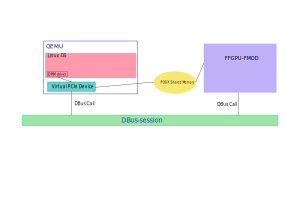

# FFGPU Virtual Plantform
FFGPU is a full stack GPU. It needs not only a functional model but also a complete virtual system plantform. We use [qemu](http://qemu.org) to developing our plantform.

## SystemC model co-Simulation with QEMU
The FFGPU function-model is a systemC model. It runs in a seprated linux process other than a thread in qemu. Because of that, qemu and ffgpu-fmod need a method to do IPC. We use DBus.

The architecture of the co-Simulation system is:

